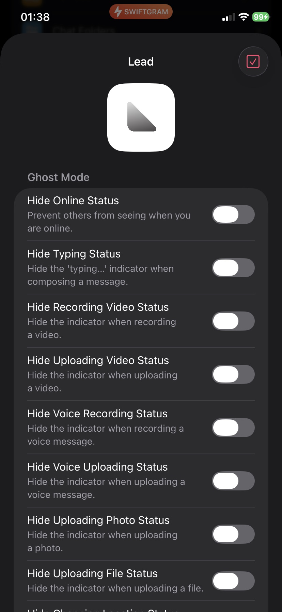
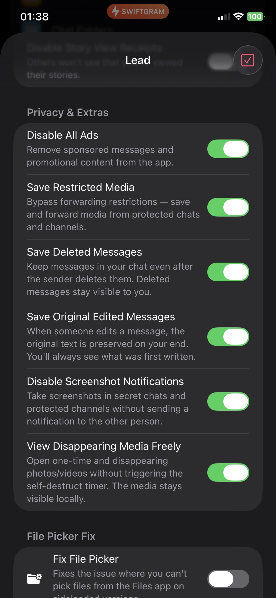
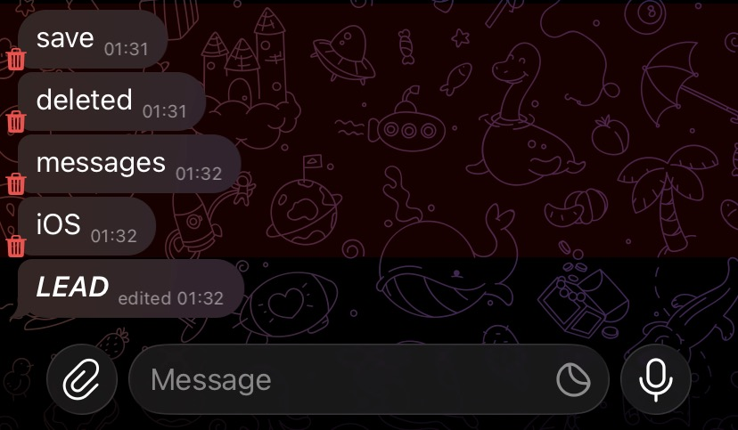

# Lead

A powerful, native-feeling iOS Tweak for the Telegram app. 

To open the Tweak menu: **Long-press the screen with 3 fingers** (or 4 fingers if no flex is injected).

## 🚀 Features

### ✅ Stable & Working
- **Anti-Revoke**: Prevent users from deleting messages. Deleted messages are retained in the chat and seamlessly marked with a native-looking 🗑️ trash icon. 
  *(Note: If a message is deleted while you are in the chat, simply scroll up and down to refresh the UI and show the indicator).*
- **Ghost Mode**: Read messages and view stories without triggering read receipts.
- **Disable Ads**: Remove sponsored messages and ads from channels.
- **Allow saving Protected Content**: Save media from restricted channels (Note: Due to frequent API updates, this feature may be limited on newer Telegram builds).

### 🚧 Beta / Work in Progress (May contain bugs)
- **Save without forwarding**: Save media directly in chats without needing to forward it first.
- **Anti-Edit**: Retain the original version of edited messages.
- **Infinite disappearing media**: View self-destructing media without limits.

## 📸 Screenshots

  
  
  

## ⚠️ Disclaimer

This project is an **independent modification (tweak)** for the Telegram app. I am **not affiliated, associated, authorized, endorsed by, or in any way officially connected with Telegram Messenger LLP**, or any of its subsidiaries or affiliates.

This tweak is created solely for **personal and educational purposes**. Use it at your own risk.

**I do not take any responsibility for any issues, damages, or consequences** resulting from the use or misuse of this tweak. If something breaks, it's not my problem.

---

### ❤️ Acknowledgements
- Special thanks to **chocolate fluffy** for providing the core code for this project.
- This project is a fork of [Aj3radi/TGExtra](https://github.com/Aj3radi/TGExtra).
